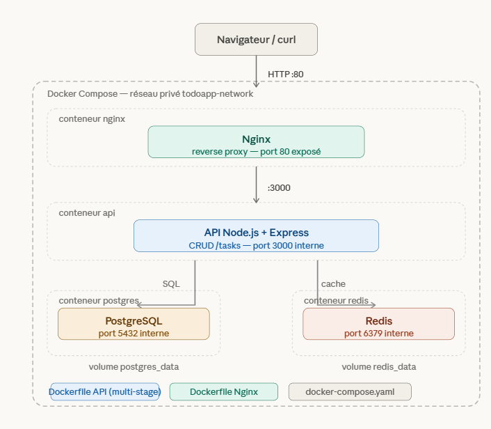

Voici l'URL du repos pour bien voir le readme :  https://github.com/RouisKalifa/projet-docker

# Todo App — Conteneurisation Docker

Application de gestion de tâches full-stack entièrement conteneurisée avec Docker.
Stack : **React · Node.js · PostgreSQL · Redis · Nginx**

> Projet réalisé dans le cadre du cours "Admin Unix et conteneurs" — LP DevOps

---

## Réponse au cahier des charges

| Exigence | Réponse apportée |
|---|---|
| Plusieurs micro-services | 5 services : `nginx`, `frontend`, `api`, `postgres`, `redis` |
| Au moins un Dockerfile | 3 Dockerfiles (nginx, api, frontend) |
| Multi-stage build | Dockerfiles `api` et `frontend` utilisent un multi-stage build |
| Au moins 2 conteneurs qui communiquent | Tous les services communiquent via un réseau Docker dédié |
| docker-compose.yaml | Présent avec healthchecks, volumes, réseau custom, depends_on |
| Lancement simple | `sudo docker compose up --build` suffit |

---

## Architecture





Le seul port exposé vers l'extérieur est le **port 80** (Nginx). Les autres services (API, base de données, cache) sont isolés dans le réseau interne Docker et ne sont pas accessibles directement depuis la machine hôte.

---

## Services

| Service    | Image de base      | Rôle                                      | Port interne |
|------------|--------------------|-------------------------------------------|--------------|
| `nginx`    | nginx:alpine       | Reverse proxy — point d'entrée unique     | 80 (exposé)  |
| `frontend` | node:20-alpine     | Interface React (multi-stage → nginx)     | 80           |
| `api`      | node:20-alpine     | API REST Node.js/Express (multi-stage)    | 3000         |
| `postgres` | postgres:16-alpine | Base de données relationnelle             | 5432         |
| `redis`    | redis:7-alpine     | Cache des lectures (TTL 60s)              | 6379         |

---

## Prérequis

- [Docker]) installé
- Git

### Installer Docker si nécessaire

**Windows / macOS :**
Téléchargez et installez [Docker Desktop](https://www.docker.com/products/docker-desktop/).

**Linux (Ubuntu) :**
```bash
sudo apt update
sudo apt install docker.io git -y
sudo systemctl start docker
sudo systemctl enable docker
sudo usermod -aG docker $USER
```
> Fermez et rouvrez le terminal après la dernière commande pour que les droits soient pris en compte.

Vérifiez que Docker est bien installé :
```bash
docker --version
```

Si la commande `docker compose` n'est pas reconnue, installez le plugin :
```bash
sudo apt install docker-compose-v2 -y
```

### S'assurer que Docker est démarré

Avant de lancer le projet, vérifiez que Docker est bien actif :

- **Windows / macOS** : ouvrez l'application **Docker Desktop** et attendez que l'icône soit verte
- **Linux** : lancez la commande suivante si Docker n'est pas déjà actif :
  ```bash
  sudo systemctl start docker
  ```

---

## Lancement

### 1. Cloner le dépôt

```bash
git clone https://github.com/RouisKalifa/projet-docker.git
cd projet-docker
```

### 2. Créer le fichier d'environnement

Le fichier `.env` contient les variables de configuration (identifiants base de données, ports…). Il n'est pas versionné pour des raisons de sécurité. Un fichier `.env.example` est fourni avec les valeurs par défaut prêtes à l'emploi.

**Linux / macOS :**
```bash
cp .env.example .env
```

**Windows (PowerShell) :**
```powershell
copy .env.example .env
```

> Aucune modification n'est nécessaire, les valeurs par défaut fonctionnent directement.

### 3. Démarrer tous les services

```bash
sudo docker compose up --build
```

Cette commande fait plusieurs choses automatiquement :
- **Build** des images Docker pour `api`, `frontend` et `nginx` à partir de leurs Dockerfiles respectifs
- **Téléchargement** des images officielles `postgres` et `redis` depuis Docker Hub
- **Démarrage** des conteneurs dans le bon ordre grâce aux `depends_on` et healthchecks
- **Création** du réseau interne `todo_network` et du volume persistant `postgres_data`
- **Création automatique** de la table `tasks` dans PostgreSQL au premier démarrage

La première exécution prend quelques minutes (téléchargement + compilation React). Les suivantes sont beaucoup plus rapides grâce au cache Docker.

L'application est disponible sur **http://localhost**

### Arrêter les services

```bash
docker compose down
```

### Supprimer les données persistantes (volumes)

```bash
docker compose down -v
```

---

## Tester l'application

### Via l'interface web

Ouvrez **http://localhost** dans un navigateur. L'interface permet de :
- Ajouter une tâche
- Cocher / décocher une tâche
- Supprimer une tâche
- Voir si la donnée vient du cache Redis ou de PostgreSQL

### Via Postman

[Postman](https://www.postman.com/downloads/) est une interface graphique pour tester des APIs REST. C'est plus simple que curl.

| Méthode | URL | Body (JSON) |
|---|---|---|
| GET | `http://localhost/tasks` | — |
| POST | `http://localhost/tasks` | `{"title": "Ma tâche"}` |
| PUT | `http://localhost/tasks/1` | `{"done": true}` |
| DELETE | `http://localhost/tasks/1` | — |

Pour les requêtes POST et PUT, sélectionnez `Body` → `raw` → `JSON` dans Postman avant d'envoyer.

---

### Via curl (API REST)


#### Créer une tâche

**Linux / macOS :**
```bash
curl -X POST http://localhost/tasks \
  -H "Content-Type: application/json" \
  -d '{"title": "Ma première tâche"}'
```

**Windows (PowerShell) :**
```powershell
curl.exe --% -X POST http://localhost/tasks -H "Content-Type: application/json" -d "{\"title\": \"Ma premiere tache\"}"
```

#### Lister toutes les tâches

**Linux / macOS :**
```bash
curl http://localhost/tasks
```

**Windows (PowerShell) :**
```powershell
curl.exe http://localhost/tasks
```

> La réponse indique `"source": "cache"` (Redis) ou `"source": "db"` (PostgreSQL).
> Effectuez deux GET successifs pour observer le cache en action.

#### Modifier une tâche

**Linux / macOS :**
```bash
curl -X PUT http://localhost/tasks/1 \
  -H "Content-Type: application/json" \
  -d '{"done": true}'
```

**Windows (PowerShell) :**
```powershell
curl.exe --% -X PUT http://localhost/tasks/1 -H "Content-Type: application/json" -d "{\"done\": true}"
```

#### Supprimer une tâche

**Linux / macOS :**
```bash
curl -X DELETE http://localhost/tasks/1
```

**Windows (PowerShell) :**
```powershell
curl.exe -X DELETE http://localhost/tasks/1
```

#### Vérifier l'état de l'API

**Linux / macOS :**
```bash
curl http://localhost/health
```

**Windows (PowerShell) :**
```powershell
curl.exe http://localhost/health
```

---

## Explication des Dockerfiles

### Dockerfile — API (multi-stage)

```dockerfile
# Stage 1 : Builder
FROM node:20-alpine AS builder   # image Node légère (Alpine Linux)
WORKDIR /app                     # répertoire de travail dans le conteneur

COPY package*.json ./            # copie uniquement les fichiers de dépendances
RUN npm install --omit=dev       # installe les dépendances (sans les devDependencies)

# Stage 2 : Image finale
FROM node:20-alpine              # repart d'une image propre
WORKDIR /app

COPY --from=builder /app/node_modules ./node_modules  # récupère uniquement node_modules du builder
COPY . .                         # copie le code source

EXPOSE 3000                      # documente le port utilisé
CMD ["node", "index.js"]         # commande de démarrage
```

**Pourquoi deux stages ?** Si on faisait tout en un seul stage, l'image finale contiendrait les outils de build inutiles en production. Avec le multi-stage, le stage `builder` fait le travail "sale" et le stage final ne garde que le strict nécessaire.

---

### Dockerfile — Frontend (multi-stage)

```dockerfile
# Stage 1 : Builder — compile l'application React
FROM node:20-alpine AS builder
WORKDIR /app

COPY package*.json ./
RUN npm install                  # installe TOUTES les dépendances (y compris Vite)

COPY . .
RUN npm run build                # compile React → génère des fichiers HTML/CSS/JS dans /dist

# Stage 2 : Image finale — sert les fichiers statiques
FROM nginx:alpine                # image Nginx ultra-légère (~20 MB)

COPY --from=builder /app/dist /usr/share/nginx/html  # copie uniquement le build compilé

EXPOSE 80
CMD ["nginx", "-g", "daemon off;"]
```

**Résultat :** l'image finale ne contient que Nginx + les fichiers HTML/CSS/JS compilés. Node.js, Vite et `node_modules` (plusieurs centaines de Mo) ne sont pas présents dans l'image de production.

---

### Dockerfile — Nginx (reverse proxy)

```dockerfile
FROM nginx:alpine

RUN rm /etc/nginx/conf.d/default.conf   # supprime la config par défaut inutile
COPY nginx.conf /etc/nginx/conf.d/app.conf  # injecte notre configuration personnalisée
```

Simple mais efficace : on part de l'image officielle et on remplace uniquement la configuration.

---

## Explication du docker-compose.yaml

```yaml
services:

  postgres:
    image: postgres:16-alpine        # image officielle PostgreSQL version 16
    env_file: .env                   # charge les variables depuis le fichier .env
    volumes:
      - postgres_data:/var/lib/postgresql/data  # persiste les données sur la machine hôte
    networks:
      - todo_network                 # connecté au réseau interne
    healthcheck:
      test: ["CMD-SHELL", "pg_isready -U ${POSTGRES_USER} -d ${POSTGRES_DB}"]
      interval: 10s                  # vérifie toutes les 10 secondes
      timeout: 5s                    # échec si pas de réponse en 5s
      retries: 5                     # déclaré "unhealthy" après 5 échecs

  redis:
    image: redis:7-alpine
    networks:
      - todo_network
    healthcheck:
      test: ["CMD", "redis-cli", "ping"]  # ping Redis pour vérifier qu'il répond
      interval: 10s
      timeout: 5s
      retries: 5

  api:
    build:
      context: ./api                 # dossier contenant le Dockerfile
      dockerfile: Dockerfile
    env_file: .env
    networks:
      - todo_network
    depends_on:
      postgres:
        condition: service_healthy   # attend que postgres soit healthy (pas juste démarré)
      redis:
        condition: service_healthy   # idem pour redis

  frontend:
    build:
      context: ./frontend
      dockerfile: Dockerfile
    networks:
      - todo_network
    depends_on:
      - api                          # démarre après l'api

  nginx:
    build:
      context: ./nginx
      dockerfile: Dockerfile
    ports:
      - "80:80"                      # seul port exposé vers l'extérieur
    networks:
      - todo_network
    depends_on:
      - api
      - frontend                     # démarre en dernier

volumes:
  postgres_data:                     # volume nommé géré par Docker (persistant)

networks:
  todo_network:
    driver: bridge                   # réseau bridge isolé pour tous les services
```

---

## Points techniques Docker

### 1. Multi-stage builds

Les Dockerfiles de `api` et `frontend` utilisent un **multi-stage build** pour produire des images légères et propres :

```
Stage 1 — builder    : installe les dépendances, compile le code
Stage 2 — final      : repart d'une image vierge, copie uniquement le résultat
```

Avantages :
- L'image finale ne contient **ni Node.js, ni les outils de build, ni node_modules** de développement
- Image `api` finale : ~50 MB au lieu de ~300 MB
- Image `frontend` finale : ~20 MB (juste Nginx + fichiers HTML/CSS/JS compilés)

### 2. Healthchecks

`postgres` et `redis` ont des healthchecks configurés dans le `docker-compose.yaml`. Docker vérifie régulièrement que ces services sont **vraiment prêts** (et pas juste démarrés) :

```yaml
# PostgreSQL : vérifie que la base accepte des connexions
test: ["CMD-SHELL", "pg_isready -U todouser -d tododb"]

# Redis : vérifie que le serveur répond
test: ["CMD", "redis-cli", "ping"]
```

### 3. Ordre de démarrage (depends_on)

```
postgres ──┐
           ├─▶ api ──┐
redis    ──┘          ├─▶ nginx
           frontend ──┘
```

L'API ne démarre que lorsque `postgres` ET `redis` sont **healthy**. Nginx démarre en dernier, une fois l'API et le frontend prêts.

### 4. Réseau Docker custom

Tous les services sont connectés au réseau `todo_network` (bridge). Cela permet :
- La communication entre services via leur **nom** (`api`, `postgres`, `redis`…)
- L'**isolation** du réseau interne : seul Nginx est accessible depuis l'extérieur (port 80)

### 5. Volume persistant

```yaml
volumes:
  postgres_data:
```

Les données PostgreSQL sont stockées dans un volume Docker nommé. Les tâches sont conservées même après un `docker compose down`.

### 6. Cache Redis

- Le endpoint `GET /tasks` met les résultats en cache dans Redis (TTL : 60 secondes)
- Toute modification (POST / PUT / DELETE) invalide le cache
- Permet de réduire les requêtes vers PostgreSQL

### 7. Sécurité Nginx

```nginx
add_header X-Frame-Options        "SAMEORIGIN"
add_header X-Content-Type-Options "nosniff"
add_header X-XSS-Protection       "1; mode=block"
add_header Content-Security-Policy "default-src 'self'; ..."
server_tokens off;
```

- Les headers HTTP sécurisent les échanges côté navigateur
- `server_tokens off` masque la version de Nginx
- Le port PostgreSQL (5432) n'est jamais exposé à l'extérieur

---

## Structure du projet

```
projet-docker/
├── .env.example              # Modèle de configuration (à copier en .env)
├── .gitignore
├── docker-compose.yaml       # Orchestration des 5 services
│
├── api/                      # API REST Node.js
│   ├── .dockerignore
│   ├── Dockerfile            # Multi-stage build
│   ├── package.json
│   ├── index.js              # Point d'entrée + connexions DB/Redis
│   └── routes/
│       └── tasks.js          # Endpoints CRUD /tasks
│
├── frontend/                 # Interface React
│   ├── .dockerignore
│   ├── Dockerfile            # Multi-stage build (Vite → Nginx)
│   ├── package.json
│   ├── vite.config.js
│   ├── index.html
│   └── src/
│       ├── main.jsx
│       ├── App.jsx           # Composant principal (CRUD + cache indicator)
│       └── index.css
│
└── nginx/                    # Reverse proxy
    ├── Dockerfile
    └── nginx.conf            # Routing + headers de sécurité
```

---

## Commandes utiles

### Voir tous les conteneurs et leur statut
```bash
docker compose ps
```

### Voir les logs d'un service en temps réel
```bash
docker compose logs -f api       # logs de l'API
docker compose logs -f nginx     # logs de Nginx
docker compose logs -f postgres  # logs de PostgreSQL
```

### Redémarrer un seul service
```bash
docker compose restart api
```

### Voir l'utilisation CPU et mémoire de chaque conteneur
```bash
docker stats
```

### Entrer dans un conteneur
```bash
docker exec -it todo_api sh        # entrer dans le conteneur de l'API
docker exec -it todo_nginx sh      # entrer dans le conteneur Nginx
```

### Voir les images Docker construites
```bash
docker images
```

### Voir les volumes Docker
```bash
docker volume ls
```

### Tout arrêter et supprimer les conteneurs
```bash
docker compose down
```

### Tout arrêter et supprimer les conteneurs + les données
```bash
docker compose down -v
```

---

## Inspecter la base de données

```bash
docker exec -it todo_postgres psql -U todouser -d tododb
```

```sql
SELECT * FROM tasks;
```
